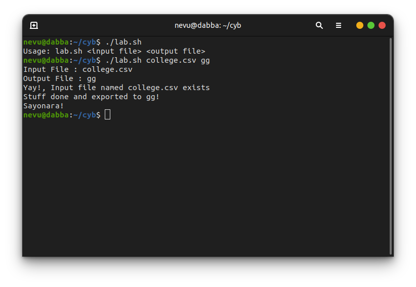
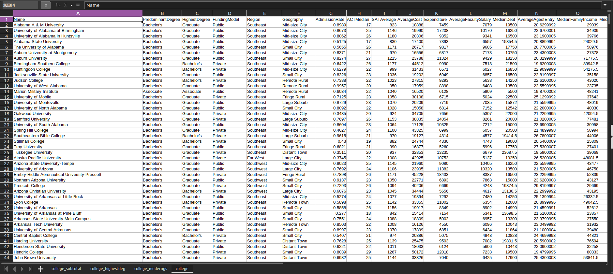
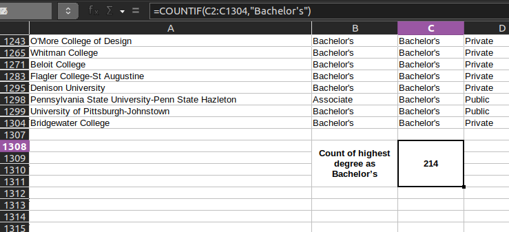
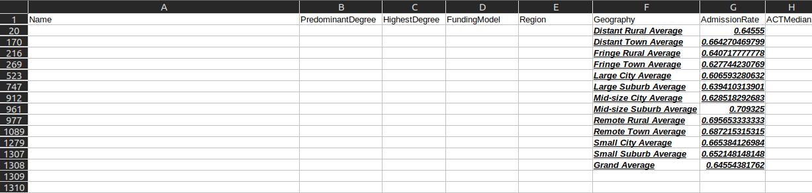
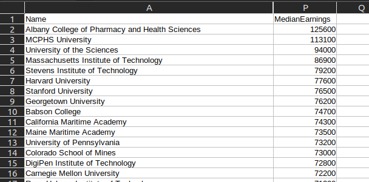

# cyb101-23-endeval

### Prog Log

I have also uploaded a spreadsheet `college.ods` (which I used for verifying the script results)

<hr>

- [x] PART 1
- [x] PART 2



<hr>

- [x] PART 3
First few lines from 'gg' (output file)

```
***************** Concise Data *****************

Name PredominantDegree HighestDegree Region Geography AdmissionRate AverageCost Expenditure
Alabama A & M University Bachelor's Graduate Southeast Mid-size City 0.8989 18888 7459
University of Alabama at Birmingham Bachelor's Graduate Southeast Mid-size City 0.8673 19990 17208
University of Alabama in Huntsville Bachelor's Graduate Southeast Mid-size City 0.8062 20306 9352
Alabama State University Bachelor's Graduate Southeast Mid-size City 0.5125 17400 7393
The University of Alabama Bachelor's Graduate Southeast Small City 0.5655 26717 9817
Auburn University at Montgomery Bachelor's Graduate Southeast Mid-size City 0.8371 16556 6817
Auburn University Bachelor's Graduate Southeast Small City 0.8274 23788 11324
Birmingham Southern College Bachelor's Bachelor's Southeast Mid-size City 0.6422 44512 9990
Huntingdon College Bachelor's Bachelor's Southeast Mid-size City 0.6279 31433 6571
```
Just like sheet



<hr>

- [x] PART 4
(Was incorrect earlier, due to wrong placement of braces)

Few lines from 'gg'
```
***************** Following are the college with HighestDegree as Bachelor's *****************

Birmingham Southern College
Huntingdon College
Judson College
Southeastern Bible College
Stillman College
Arizona Christian University
Lyon College

...

Beloit College
Northland College
Ripon College
Watkins College of Art Design & Film
Neumont University
Count: 214
```

Count confirmed from spreadsheet



<hr>

- [x] PART 5

```
***************** Geography : Average Admission Rate *****************

Fringe Town: 0.627744
Remote Town: 0.687215
Small Suburb: 0.652148
Distant Town: 0.66427
Fringe Rural: 0.640718
Large City: 0.606593
Mid-size City: 0.628518
Distant Rural: 0.64555
Remote Rural: 0.695653
Small City: 0.665384
Large Suburb: 0.63941
Mid-size Suburb: 0.709325
```

Verified from sheet



<hr>

- [x] PART 6
(Was incorrect earlier due to *lexicographic* comparison of Median Earnings instead of *numerical* comparison)

```
***************** Top 5 Colleges according to MedianEarnings *****************

Albany College of Pharmacy and Health Sciences: 125600
MCPHS University: 113100
University of the Sciences: 94000
Massachusetts Institute of Technology: 86900
Stevens Institute of Technology: 79200
```

Sheet says



<hr>

Done
